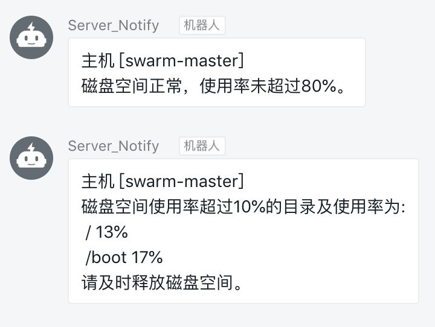

### disk-monitor

#### # parameters

* `dingtalk_token` -- **`Required`** dingtalk token
* `max_percent` -- threshold percent,default `80%`
* `custom_host` -- default get `hostname` or custom by yourself
* `send_when_normal` -- Whether to send notify when disk space is normal,default `false`

#### how to use

```
$ chmod +x ./disk-monitor.sh
$ ./disk-monitor.sh <dingtalk_token>

$ ./disk-monitor.sh <dingtalk_token> <max_percent> <custom_host> <send_when_normal>
```

#### use with crontab

```
$ crontab -l
* * * * * /home/tiger/disk-monitor.sh <dingtalk_token> > /dev/null
```

#### demo


