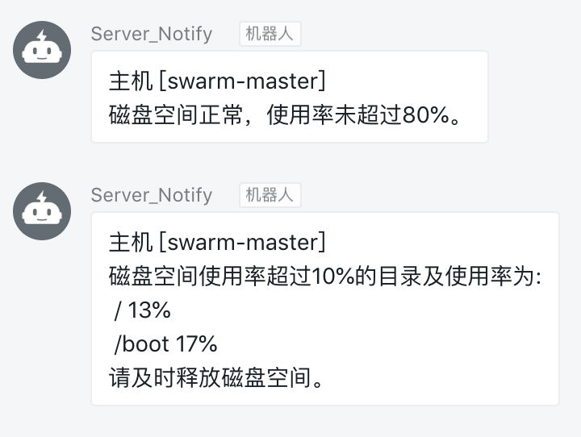

### disk-monitor

#### parameters

* `-t` -- `dingtalk_token`:  **`Required`** dingtalk token
* `-p` -- `max_percent`: threshold percent,default `80`,between `0` to `100`
* `-h` -- `custom_host`: default get `hostname` or custom by yourself
* `-n` -- `send_when_normal`: Whether to send notify when disk space is normal,default `false`

#### how to use

```
$ chmod +x ./disk-monitor.sh
$ ./disk-monitor.sh -t <dingtalk_token>

$ ./disk-monitor.sh -t <dingtalk_token> -n <send_when_normal>
```

#### use with crontab

```
$ crontab -l
* * * * * /home/tiger/disk-monitor.sh -t <dingtalk_token> > /dev/null 2>&1 &
```

#### demo



Article: [监控磁盘空间使用率并发送钉钉提醒 | IT范儿](https://www.itfanr.cc/2019/06/18/disk-monitor-send-dingtalk/)
